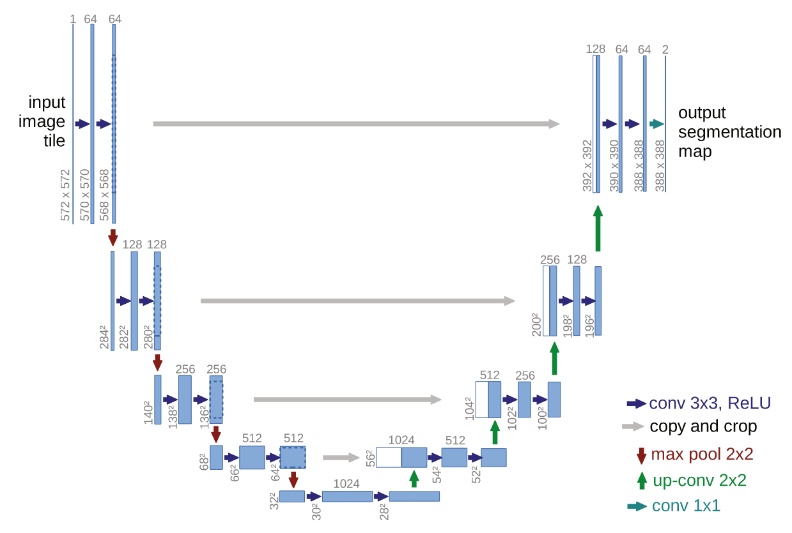

# Trouble



 ```python
 # Decoder
 up1 = self.init_conv_up(down2)
 up2 = self.up1(context_embedding1 * up1 + time_embedding1, down2)
 up3 = self.up2(context_embedding2 * up2 + time_embedding2, down1)
 ```


# Progress