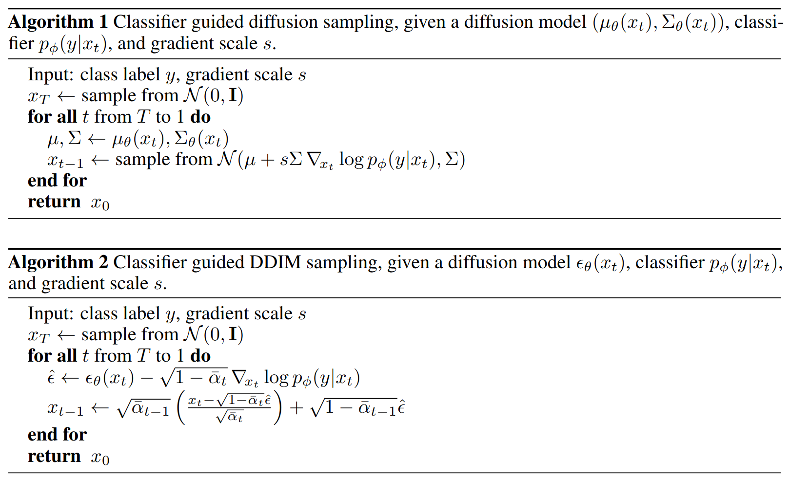

#### paper

- [x] Denoising Diffusion Implicit Models (DDIM)

$$
\begin{align}
    x_t = \sqrt{\alpha_t} x_0 + \sqrt{1 - \alpha_t} \epsilon, \quad \text{where} \quad \epsilon \sim \mathcal{N}(\mathbf{0}, \mathbf{I}).
\end{align}
$$

$$
\begin{gather} 
   q_\sigma(x_{t-1} | x_t, x_0) = N\left(\sqrt{\alpha_{t-1}} x_{0} + \sqrt{1 - \alpha_{t-1} - \sigma^2_t} \cdot {\frac{x_{t}  - \sqrt{\alpha_{t}} x_0}{\sqrt{1 - \alpha_{t}}}}, \sigma_t^2 I \right). \label{eq:reversed-close-form}
\end{gather}
$$

$$
\begin{align}
    p_\theta^{(t)}(x_{t-1} | x_t) = \begin{cases}
    \mathcal{N}(f_\theta^{(1)}(x_1), \sigma_1^2 I)  & \text{if} \ t = 1 \\
    q_\sigma(x_{t-1} | x_t, f_{\theta}^{(t)}(x_t)) & \text{otherwise,}
    \end{cases} \label{eq:new-reverse}
\end{align}
$$

$$
\begin{align}
    x_{t-1} & = \sqrt{\alpha_{t-1}} \underbrace{\left(\frac{x_t - \sqrt{1 - \alpha_t} \epsilon_\theta^{(t)}(x_t)}{\sqrt{\alpha_t}}\right)}_{\text{`` predicted } x_0 \text{''}} + \underbrace{\sqrt{1 - \alpha_{t-1} - \sigma_t^2} \cdot \epsilon_\theta^{(t)}(x_t)}_{\text{``direction pointing to } x_t \text{''}} + \underbrace{\sigma_t \epsilon_t}_{\text{random noise}} 
\end{align}
$$

- [x] Diffusion Models Beat GANs on Image Synthesis (Conditional Diffusion)

$$
p_{\theta,\phi}(x_t|x_{t+1},y)\propto p_{\theta}(x_t|x_{t+1})p_{\phi}(y|x_t)
$$

- [ ] High-Resolution Image Synthesis With Latent Diffusion Models (Stable Diffusion)

- [ ] Adding Conditional Control to Text-to-Image Diffusion Models (ControlNet)

- [ ] Photorealistic Text-to-Image Diffusion Models with Deep Language Understanding (Imagen)

- [ ] Scalable Diffusion Models with Transformers (DiT)

