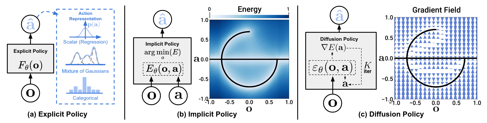
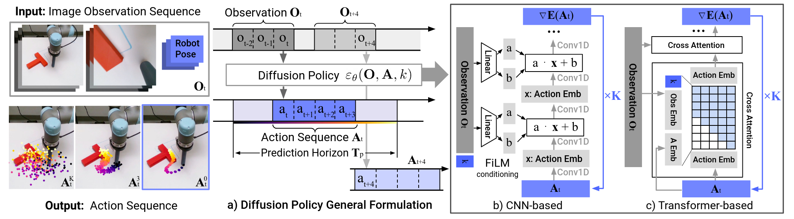

#### paper

- [x] Diffusion Policy: Visuomotor Policy Learning via Action Diffusion

$$
\mathbf{x}_{t-1}=\frac{1}{\sqrt{\alpha_t}}\left(\mathbf{x}_t-\frac{\beta_t}{\sqrt{1-\bar{\alpha}_t}} \boldsymbol{\epsilon}_\theta\left(\mathbf{x}_t, t\right)\right)+\sigma_t \mathbf{z}, \text { where } \mathbf{z} \sim \mathcal{N}(\mathbf{0}, \mathbf{I})\\

\mathbf{x}^{k-1}=\alpha\left(\mathbf{x}^k-\gamma \varepsilon_\theta\left(\mathbf{x}^k, k\right)+\mathscr{N}\left(0, \sigma^2 I\right)\right) \\

\mathbf{x}^{\prime}=\mathbf{x}-\gamma \nabla E(\mathbf{x})
$$

$$
\mathbf{A}_t^{k-1}=\alpha\left(\mathbf{A}_t^k-\gamma \varepsilon_\theta\left(\mathbf{O}_t, \mathbf{A}_t^k, k\right)+\mathscr{N}\left(0, \sigma^2 I\right)\right) \\

\mathscr{L}=\operatorname{MSE}\left(\varepsilon^k, \varepsilon_\theta\left(\mathbf{O}_t, \mathbf{A}_t^0+\varepsilon^k, k\right)\right)
$$

- [ ] Diffusion Reward: Learning Rewards via Conditional Video Diffusion
