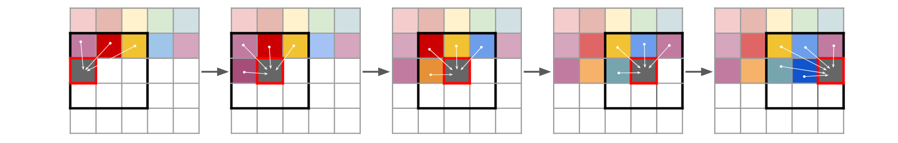

#### paper

- [x] Diffusion Policy: Visuomotor Policy Learning via Action Diffusion


$$
\mathbf{x}_{t-1}=\frac{1}{\sqrt{\alpha_t}}\left(\mathbf{x}_t-\frac{\beta_t}{\sqrt{1-\bar{\alpha}_t}} \boldsymbol{\epsilon}_\theta\left(\mathbf{x}_t, t\right)\right)+\sigma_t \mathbf{z}, \text { where } \mathbf{z} \sim \mathcal{N}(\mathbf{0}, \mathbf{I})\\

\mathbf{x}^{k-1}=\alpha\left(\mathbf{x}^k-\gamma \varepsilon_\theta\left(\mathbf{x}^k, k\right)+\mathscr{N}\left(0, \sigma^2 I\right)\right) \\

\mathbf{x}^{\prime}=\mathbf{x}-\gamma \nabla E(\mathbf{x})
$$

$$
\mathbf{A}_t^{k-1}=\alpha\left(\mathbf{A}_t^k-\gamma \varepsilon_\theta\left(\mathbf{O}_t, \mathbf{A}_t^k, k\right)+\mathscr{N}\left(0, \sigma^2 I\right)\right) \\

\mathscr{L}=\operatorname{MSE}\left(\varepsilon^k, \varepsilon_\theta\left(\mathbf{O}_t, \mathbf{A}_t^0+\varepsilon^k, k\right)\right)
$$

- [x] Vector Quantized Diffusion Model for Text-to-Image Synthesis (VQ-Diffusion)


$$
\boldsymbol{Q}_t =\left[\begin{array}{ccccc}
\alpha_t+\beta_t & \beta_t & \beta_t & \cdots & 0 \\
\beta_t & \alpha_t+\beta_t & \beta_t & \cdots & 0 \\
\beta_t & \beta_t & \alpha_t+\beta_t & \cdots & 0 \\
\vdots & \vdots & \vdots & \ddots & \vdots \\
\gamma_t & \gamma_t & \gamma_t & \cdots & 1
\end{array}\right]
$$


#### code

- [x] Taming Transformers for High-Resolution Image Synthesis (VQGAN)


$$
\begin{gathered}
\mathcal{L}_{\text{VQ}}(E, G, Z) = \Vert x - \hat{x} \Vert^2 
  + \Vert \text{sg}[E(x)] - z_q \Vert_2^2 \nonumber + \beta \Vert \text{sg}[z_q] - E(x) \Vert_2^2 \\
  
\mathcal{L}_{\text{GAN}}(\{E, G, Z \}, D) =
  \left [ \log D(x) + \log (1 - D(\hat{x}))\right] \\

\mathcal{Q}^* = \arg \min_{E, G, Z} \max_{D}
  \mathbb{E}_{x\sim p(x)} [
    \mathcal{L}_{\text{VQ}}(E, G, Z) \nonumber
    + \lambda \mathcal{L}_{\text{GAN}}(\{E, G, Z \}, D)
    ] \\

\lambda = \frac{\nabla_{G}[ \mathcal{L}_{\text{rec}} ]}{\nabla_{G_L} [\mathcal{L}_{\text{GAN}}] + \delta}

\end{gathered}
$$



<center> trained on NVIDIA GeForce RTX 3080 Laptop GPU </center>


<center> trained on 8 * NVIDIA GeForce RTX 2080 Ti </center>

#### [Pytorch Lightning](https://lightning.ai/docs/pytorch/latest/levels/core_skills.html#)

```diff
+ import lightning as L
  import torch
  import torchvision as tv

  dataset = tv.datasets.CIFAR10("data", download=True,
                               train=True,
                               transform=tv.transforms.ToTensor())

+ fabric = L.Fabric()
+ fabric.launch()

  model = tv.models.resnet18()
  optimizer = torch.optim.SGD(model.parameters(), lr=0.001)
- device = "cuda" if torch.cuda.is_available() else "cpu"
- model.to(device)
+ model, optimizer = fabric.setup(model, optimizer)

  dataloader = torch.utils.data.DataLoader(dataset, batch_size=8)
+ dataloader = fabric.setup_dataloaders(dataloader)

  model.train()
  num_epochs = 10
  for epoch in range(num_epochs):
      for batch in dataloader:
          inputs, labels = batch
-         inputs, labels = inputs.to(device), labels.to(device)
          optimizer.zero_grad()
          outputs = model(inputs)
          loss = torch.nn.functional.cross_entropy(outputs, labels)
-         loss.backward()
+         fabric.backward(loss)
          optimizer.step()
          print(loss.data)
```

- [x] Learning Complex Dexterous Manipulation with  Deep Reinforcement Learning and Demonstrations


<center>Env : Door, Hammer, Pen, Relocate</center>


<center>Adroit Door</center>


<center>render</center>

#### [Stable Baselines3](https://stable-baselines3.readthedocs.io/en/master/guide/rl.html)

```python
import mj_envs
import gym
from stable_baselines3 import TD3

env = gym.make("door-v1")
model = TD3("MlpPolicy", env, verbose=1)
model.learn(total_timesteps=500000, progress_bar=True, save_process=True, log_interval=1)

model.save("a2c_door_v1")
del model
```

| Name          | Box  | Discrete | MultiDiscrete | MultiBinary | Code |
| ------------- | ---- | -------- | ------------- | ----------- | ---- |
| ARS           | √    | √        |               |             |      |
| A2C           | √    | √        | √             | √           | √    |
| CrossQ        | √    |          |               |             |      |
| DDPG          | √    |          |               |             | √    |
| DQN           |      | √        |               |             | √    |
| HER           | √    | √        |               |             |      |
| PPO           | √    | √        | √             | √           | √    |
| QR-DQN        |      | √        |               |             |      |
| RecurrentPPO  | √    | √        | √             | √           |      |
| SAC           | √    |          |               |             | √    |
| TD3           | √    |          |               |             |      |
| TQC           | √    |          |               |             |      |
| TRPO          | √    | √        | √             | √           | √    |
| Maskable  PPO |      | √        | √             | √           |      |

