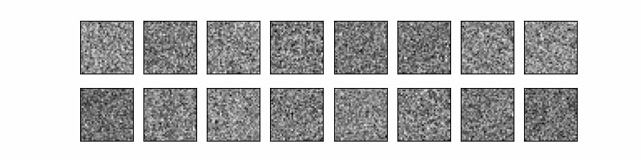

#### code

DDPM        https://github.com/d3ac/Denoising-Diffusion-Probabilistic-Models

trained on MNIST, CIFA10 and sprites_v1.

#### paper

+ U-Net: Convolutional Networks for Biomedical Image Segmentation (U-Net)
+ Improved Denoising Diffusion Probabilistic Models (Improved DDPM)

-----