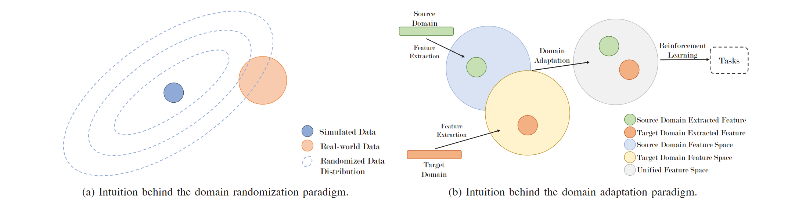
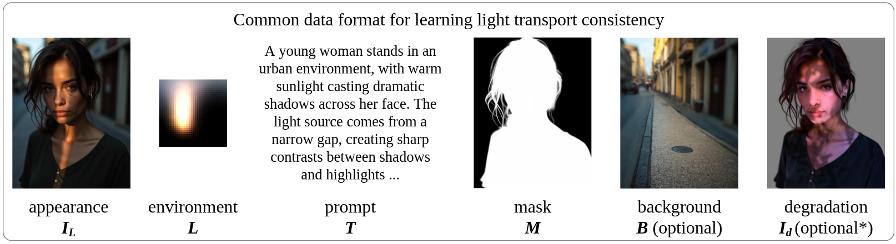
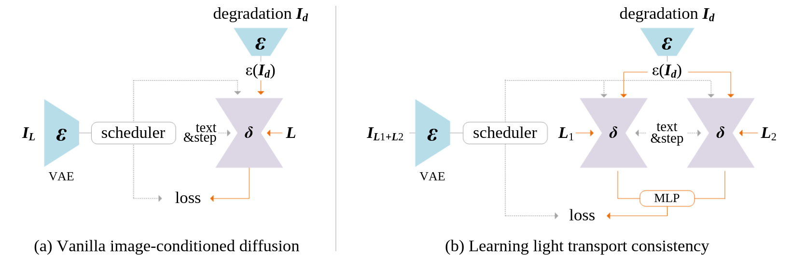

#### paper

- [x] Sim-to-Real Transfer in Deep Reinforcement  Learning for Robotics: a Survey

- #####  domain adaptation (align)

  - discrepancy-based method.

    **M**aximum **M**ean **D**iscrepancy (**MMD**)
    $$
    MMD^2(X, Y) = \frac{1}{m(m - 1)} \sum_{i} \sum_{j \neq i} k(x_i, x_j) - 2 \frac{1}{m \cdot m} \sum_{i} \sum_{j} k(x_i, y_j)+ \frac{1}{m(m - 1)} \sum_{i} \sum_{j \neq i} k(y_i, y_j)
    $$

  - adversarial-based method.

  - reconstruction based method.

- [x] Scaling In-the-Wild Training for Diffusion-Based Illumination Harmonization and Editing by Imposing Consistent Light Transport (IC-Light)

+ We reshape any 32 × 32 × 3 HDRI environment light source image L to 3072 numbers and train a MLP from scratch.

$$
\mathcal{L}_{\text{vanilla}} = \|\epsilon - \delta(\epsilon(I_L)_t, t, L, \epsilon(I_d))\|_2^2
$$

+ latent diffusion algorithms first encode $I_L$ as a latent image $\epsilon(I_L)$, and then progressively add noise to the latent image to produce a noisy latent $\epsilon(I_L)_t$. 

$$
I_{L_1 + L_2}^* = T(L_1 + L_2) = I_{L_1}^* + I_{L_2}^*
$$

$$
\mathcal{L}_{\text{consistency}} = \bigg|\bigg| M \odot \Big(\epsilon - \phi \Big(\delta(\epsilon(I_{L_1}), t, L_1, \epsilon(I_d)), \delta \epsilon(I_{L_2}), t, L_2, \epsilon(I_d)\Big)\Big)\bigg|\bigg|_2^2
$$

$$
\mathcal{L} = \lambda_{\text{vanilla}} \mathcal{L}_{\text{vanilla}} + \lambda_{\text{consistency}} \mathcal{L}_{\text{consistency}}
$$

