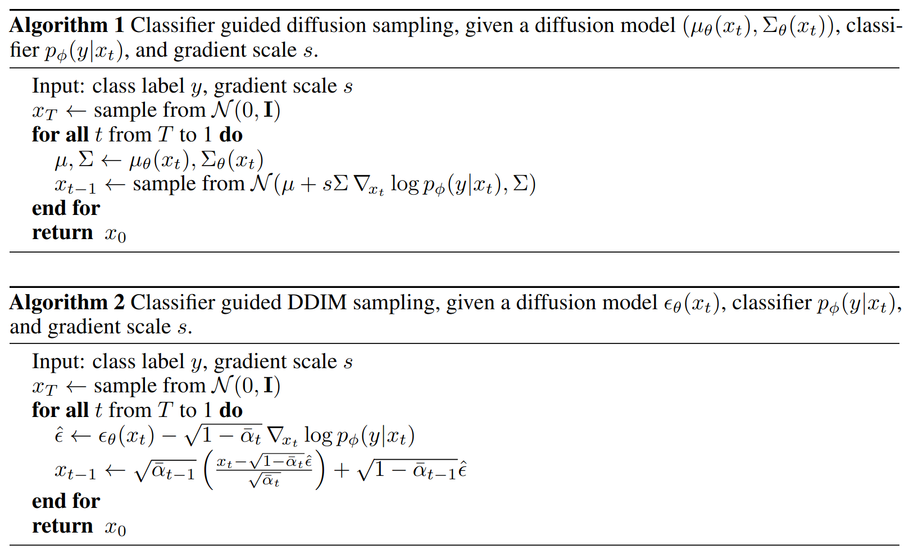

#### paper

- [x] Denoising Diffusion Implicit Models (DDIM)

$$
\begin{align}
    x_t = \sqrt{\alpha_t} x_0 + \sqrt{1 - \alpha_t} \epsilon, \quad \text{where} \quad \epsilon \sim \mathcal{N}(\mathbf{0}, \mathbf{I}).
\end{align}
$$

$$
\begin{gather} 
   q_\sigma(x_{t-1} | x_t, x_0) = N\left(\sqrt{\alpha_{t-1}} x_{0} + \sqrt{1 - \alpha_{t-1} - \sigma^2_t} \cdot {\frac{x_{t}  - \sqrt{\alpha_{t}} x_0}{\sqrt{1 - \alpha_{t}}}}, \sigma_t^2 I \right). \label{eq:reversed-close-form}
\end{gather}
$$

$$
\begin{align}
    p_\theta^{(t)}(x_{t-1} | x_t) = \begin{cases}
    \mathcal{N}(f_\theta^{(1)}(x_1), \sigma_1^2 I)  & \text{if} \ t = 1 \\
    q_\sigma(x_{t-1} | x_t, f_{\theta}^{(t)}(x_t)) & \text{otherwise,}
    \end{cases} \label{eq:new-reverse}
\end{align}
$$

$$
\begin{align}
    x_{t-1} & = \sqrt{\alpha_{t-1}} \underbrace{\left(\frac{x_t - \sqrt{1 - \alpha_t} \epsilon_\theta^{(t)}(x_t)}{\sqrt{\alpha_t}}\right)}_{\text{`` predicted } x_0 \text{''}} + \underbrace{\sqrt{1 - \alpha_{t-1} - \sigma_t^2} \cdot \epsilon_\theta^{(t)}(x_t)}_{\text{``direction pointing to } x_t \text{''}} + \underbrace{\sigma_t \epsilon_t}_{\text{random noise}} 
\end{align}
$$

- [x] Diffusion Models Beat GANs on Image Synthesis (Guided Diffusion)

$$
p_{\theta,\phi}(x_t|x_{t+1},y)\propto p_{\theta}(x_t|x_{t+1})p_{\phi}(y|x_t)
$$



- [x] Neural Discrete Representation Learning (VQ-VAE)


$$
\begin{gathered}

\mathbf{x} \in \mathbb{R}^{H \times W \times 3} \xrightarrow[\text { encoder }]{\mathrm{CNN}} \mathbf{z}_{\mathbf{e}}(\mathbf{x}) \in \mathbb{R}^{H \times W \times D} \xrightarrow[\text { quantizer }]{\text { look-up }} \mathbf{z}_{\mathbf{q}}(\mathbf{x}) \in \mathbb{R}^{H \times W \times D} \xrightarrow[\text { decoder }]{\mathrm{CNN}} \hat{\mathbf{x}} \\

z_q=C_k, \quad k=\operatorname{argmin}_j\left\|z_e-C_j\right\|, \quad C \in \mathbb{R}^{K \times D} \\

\mathcal{L}_{\text {reconstruct }}=\left\|x-\operatorname{decoder}\left(z_e(x)+\operatorname{sg}(z_q(x)-z_ e(x))\right)\right\|_2^2 \\

s g(x)= \begin{cases}x, & \text { forward } \\ 0, & \text { backward }\end{cases} \\

\mathcal{L}_{\text {commit }}=\beta\left\|z_e(x)-\operatorname{sg}\left(z_q(x)\right)\right\|_2^2 \\ \mathcal{L}_{\text {vector quantisation }}=\left\|s g\left(z_e(x)\right)-z_q(x)\right\|_2^2 \\

\mathcal{L}=
\underbrace{\left\|x-\operatorname{decoder}\left(z_e(x)+\operatorname{sg}(z_q(x)-z_e(x))\right)\right\|_2^2}_{\text{train both encoder and decoder}} 
+
\underbrace{\beta\left\|z_e(x)-\operatorname{sg}\left(z_q(x)\right)\right\|_2^2}_{\text{train encoder}} 
+
\underbrace{\left\|s g\left(z_e(x)\right)-z_q(x)\right\|_2^2}_{\text{train codebook}} 
\end{gathered}
$$

> Language Model Beats Diffusion  — Tokenizer Is Key To Visual Generation (MAGVIT-v2)

- [x] The Unreasonable Effectiveness of Deep Features as a Perceptual Metric (LPIPS)


$$
\begin{equation}
d(x,x_0) = \sum_l \dfrac{1}{H_l W_l} \sum_{h,w} || w_l \odot ( \hat{y}_{hw}^l - \hat{y}_{0hw}^l ) ||_2^2
\end{equation}
$$

- **lin** : keep pre-trained network weights $\mathcal{F}$ fixed, and learn linear weights w on top.
- **tune** : initialize from a pre-trained model, and allow all the weights for network F to be fine-tuned.
- **scratch** : initialize the network from random Gaussian weights and train it entirely on our judgments.

```python
import lpips
import torch

loss_fn_alex = lpips.LPIPS(net='alex')
img0 = torch.zeros(1,3,64,64) # image should be RGB, IMPORTANT: normalized to [-1,1]
img1 = torch.zeros(1,3,64,64)
d = loss_fn_alex(img0, img1)
```

- [x] Taming Transformers for High-Resolution Image Synthesis (VQGAN)


$$
\begin{gathered}
\mathcal{L}_{\text{VQ}}(E, G, Z) = \Vert x - \hat{x} \Vert^2 
  + \Vert \text{sg}[E(x)] - z_q \Vert_2^2 \nonumber + \beta \Vert \text{sg}[z_q] - E(x) \Vert_2^2 \\
  
\mathcal{L}_{\text{GAN}}(\{E, G, Z \}, D) =
  \left[ \log D(x) + \log (1 - D(\hat{x}))\right] \\

\mathcal{Q}^* = \arg \min_{E, G, Z} \max_{D}
  \mathbb{E}_{x\sim p(x)} [
    \mathcal{L}_{\text{VQ}}(E, G, Z) \nonumber
    + \lambda \mathcal{L}_{\text{GAN}}(\{E, G, Z \}, D)
    ] \\

\lambda = \frac{\nabla_{G}[ \mathcal{L}_{\text{rec}} ]}{\nabla_{G_L} [\mathcal{L}_{\text{GAN}}] + \delta}

\end{gathered}
$$

<center><font color="red">perceptual reconstruction loss?</font></center>


- [x] High-Resolution Image Synthesis With Latent Diffusion Models (Latent Diffusion)


$$
Q=W_Q^{(i)} \cdot \varphi_i\left(z_t\right), K=W_K^{(i)} \cdot \tau_\theta(y), V=W_V^{(i)} \cdot \tau_\theta(y)
$$

+ $\varphi_i(z_t)$ : flattened intermediate representation of the UNet implementing $\epsilon_\theta$.
+ $\tau_{\theta}(y)$ : projects $y$ to an intermediate representation from various modalities.

$$
L_{L D M}:=\mathbb{E}_{\mathcal{E}(x), y, \epsilon \sim \mathcal{N}(0,1), t}\left[\left\|\epsilon-\epsilon_\theta\left(z_t, t, \tau_\theta(y)\right)\right\|_2^2\right]
$$

<center><font color="red">what if we swap Q and K,V ?</font></center>

----

#### Nextweek

- [ ] Adding Conditional Control to Text-to-Image Diffusion Models (ControlNet)

- [ ] Photorealistic Text-to-Image Diffusion Models with Deep Language Understanding (Imagen)

- [ ] Scalable Diffusion Models with Transformers (DiT)

- [ ] **code** : latent diffusion
