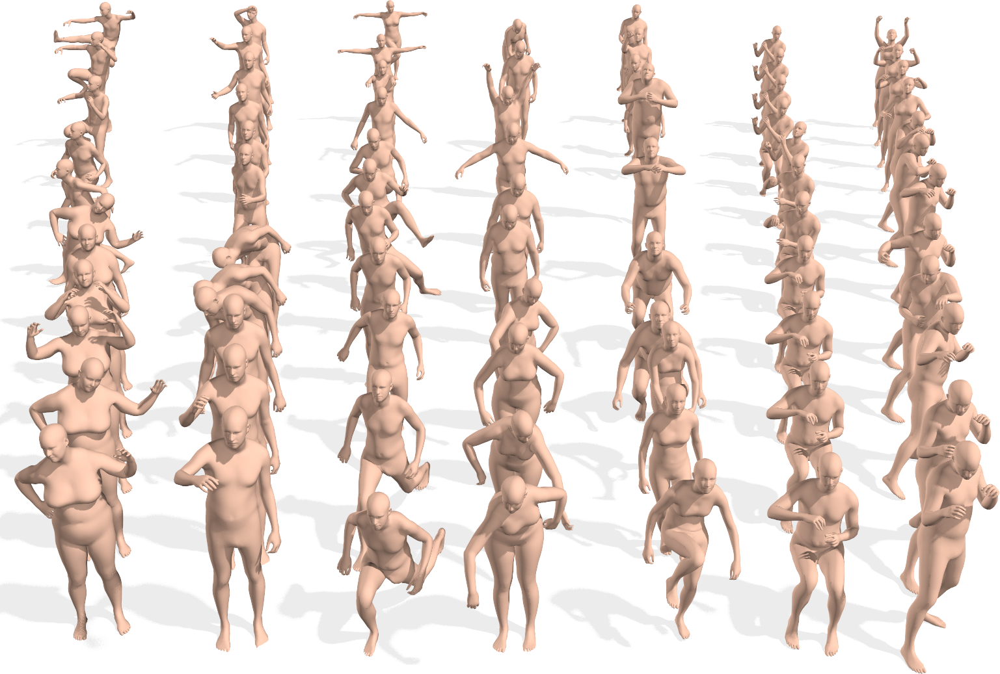

#### introduction & abstract $\to$ paper

- [x] Generalizable Humanoid Manipulation with  Improved 3D Diffusion Policies (iDP3) 

> + 3D visuomotor policies rely on camera calibration and point-cloud segmentation $\to$ confined to a specific scenario.
> + a whole-upper-body teleoperation system.
> + train in Single Scene and Generalize to Diverse Scenes.

- [x] Deep Imitation Learning for Humanoid Loco-manipulation  through Human Teleoperation (TRILL)

> + loco-manipulation policies from human demonstrations. (real world).
> + incorporate the whole-body control formulation into data collection and policy learning.

- [x] Real-World Humanoid Locomotion  with Reinforcement Learning

> + trained with  large-scale reinforcement learning on thousands of randomized environments in simulation and  deployed to the real world in a zero-shot fashion.
> + assume observation-action history contains useful information about the world that a  powerful transformer model can use to adapt its behavior in-context, without  updating its weights.

- [x] Expressive Whole-Body Control for  Humanoid Robots (ExBody)

> + whole-body control by RL.
> + leverage the large-scale human motion capture data from the graphics community in a Reinforcement Learning framework.
> + encouraging the upper humanoid body to imitate a reference motion, while relaxing the imitation constraint on its two legs.

- [x] Learning Human-to-Humanoid Real-Time Whole-Body Teleoperation (H2O)

> + RL based framework that enables realtime whole-body teleoperation of a full-sized humanoid robot with only an RGB camera.
> + retargeting, sim-to-real training, real-time teleoperation.

- [x] Humanoid Locomotion as Next Token Prediction

> + cast real-world humanoid control as a next token prediction problem.
> + enables a full-sized humanoid to walk in San Francisco zero-shot
> + autoregressive policies trained from offline data.

- [x] HumanPlus: Humanoid Shadowing and Imitation from Humans

> + follow human body and hand motion in real time using only a RGB camera.
> + train low-level policy via RL, using 40-hour human motion datasets.

- [x] Open-TeleVision: Teleoperation with Immersive Active Visual Feedback

> + perform teleoperation with high precision applicable to different VR devices on different robots and manipulators.

- [x] OmniH2O: Universal and Dexterous Human-to-Humanoid Whole-Body Teleoperation and Learning (OmniH2O)

> + teleoperation enables various ways for a human to control.
> + the first humanoid loco-manipulation dataset.

- [x] Prompt, Plan, Perform: LLM-based Humanoid Control  via Quantized Imitation Learning

> + simulation only.
> + combines adversarial imitation learning with large language models.
> + use codebook-based vector quantization.
> + use CLIP to refine the complexity of the LLM’s outputs, enhances the robustness of the system.

- [x] Sim-to-Real Learning for Humanoid Box Loco-Manipulation

> + sim-to-real reinforcement learning approach for training general box pickup and carrying skills.

- [x] Whole-body Humanoid Robot Locomotion with Human Reference

> + developed a full-size humanoid robot.
> + imitation learning framework based on an adversarial motion prior.
> + reduces the Sim2Real gap and improves the learning ability and adaptability

- [x] Revisiting Reward Design and Evaluation for  Robust Humanoid Standing and Walking

> + propose a low-cost, quantitative benchmarking method to evaluate. 
> + compare the real-world performance of standing and walking (SaW) controllers on metrics like command following.

- [x] Humanoid Parkour Learning

> + end-to-end vision-based whole-body-control with RL (primarily for the legs)

- [x] OKAMI: Teaching Humanoid Robots Manipulation Skills through Single Video Imitation

> + generates a manipulation plan from a single RGB-D video and derives a policy for execution.
> + Imitation From Videos, Motion Retargeting

#### code

- [x] AMASS: Archive of Motion Capture as Surface Shapes

+ 41 hours of motion data
+ a large and varied database of human motion that unifies 15 different optical marker-based mocap datasets by representing them within a common framework and parameterization

- [x] Expressive Whole-Body Control for Humanoid Robots [link](https://github.com/chengxuxin/expressive-humanoid)

- [Isaac Gym](https://developer.nvidia.com/isaac-gym) (old), [Isaac Lab](https://developer.nvidia.com/isaac/sim#isaac-lab) (new)
  + SimReady Assets $\to$ [NVIDIA Omniverse](https://developer.nvidia.com/isaac/sim#isaac-lab) (physical AI-powered applications)

- fbx (for motion capture devices / 3D animation)

